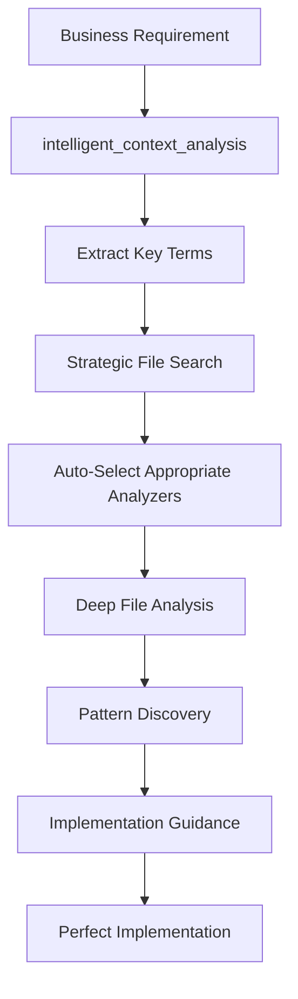

# 🧠 Intelligent AI Agent for IFS Cloud

## Overview

The IFS Cloud MCP Server now features an **Intelligent AI Agent** that automatically leverages all the built analyzers and tools to deeply understand the codebase before implementing any business requirements. This ensures that every change fits perfectly with existing IFS Cloud patterns and architecture.

## 🎯 The Intelligence Revolution

### Before: Basic AI Approach

```
User: "Add customer order validation"
AI: Creates validation code based on general patterns
Result: Code that works but may not match IFS Cloud conventions
```

### After: Intelligent AI Agent

```
User: "Add customer order validation"
AI: 1. Automatically searches for "validation", "customer", "order"
    2. Finds relevant PLSQL, Entity, and Client files
    3. Analyzes files with appropriate analyzers
    4. Discovers existing validation patterns (Check_Insert___, etc.)
    5. Identifies existing Customer APIs to leverage
    6. Generates code that perfectly matches IFS Cloud patterns
Result: Perfect architectural consistency and maintainability
```

## 🔧 Intelligent Tools

### 1. `intelligent_context_analysis` 🎯

**The most important tool - USE THIS FIRST for any business requirement!**

**What it does:**

- Automatically extracts key terms from business requirements
- Strategically searches the indexed IFS Cloud codebase
- Analyzes found files with appropriate analyzers (PLSQL, Client, Projection, Fragment)
- Discovers existing patterns, APIs, and best practices
- Provides comprehensive implementation guidance

**Example Usage:**

```python
intelligent_context_analysis(
    "Create customer order validation to check credit limits",
    domain="ORDER"
)
```

**Automatic Process:**

1. **Concept Extraction** - Extracts "customer", "order", "validation", "credit"
2. **Strategic Discovery** - Searches for validation patterns, customer APIs, order logic
3. **Deep Analysis** - Analyzes found files with PLSQL/Client/Projection analyzers
4. **Implementation Guidance** - Provides specific recommendations and existing APIs to use

### 2. Enhanced File Analyzers

All analyzers now include detailed **AI Agent Guidance** that tells the AI exactly when and how to use each tool:

#### PLSQL Analyzer 🔧

- **Use for:** Business logic, APIs, validations, calculations
- **Perfect for:** Understanding existing business rules and validation patterns
- **Provides:** Public methods, private implementations, validation rules, constants

#### Client Analyzer 🖥️

- **Use for:** UI patterns, user interfaces, commands, navigation
- **Perfect for:** Understanding existing UI conventions and user interaction patterns
- **Provides:** Pages, lists, commands, dialogs, navigation structures

#### Projection Analyzer 🗃️

- **Use for:** Data models, entities, queries, actions
- **Perfect for:** Understanding data access patterns and API surface
- **Provides:** Entities, actions, functions, queries, relationships

#### Fragment Analyzer 🌟

- **Use for:** Full-stack components combining UI and data
- **Perfect for:** Understanding complete component architecture
- **Provides:** Client sections, projection sections, integration patterns

## 🚀 AI Agent Workflow

When you give the AI any business requirement, it now automatically follows this intelligent workflow:



### Phase 1: Concept Extraction 🔍

- Extracts meaningful keywords from business requirements
- Identifies IFS Cloud domain terms and patterns
- Maps requirements to search strategies

### Phase 2: Strategic Discovery 🔎

- **Direct keyword searches** for primary concepts
- **Pattern-based searches** for validation, calculation, API patterns
- **Entity-based searches** for domain-specific structures
- **Module-specific searches** when domain is specified

### Phase 3: Deep Analysis 🔬

- Automatically selects appropriate analyzer for each file type
- Extracts business logic patterns from PLSQL files
- Discovers UI patterns from Client files
- Maps data models from Projection files
- Understands full-stack patterns from Fragment files

### Phase 4: Implementation Guidance 🎯

- Synthesizes discovered patterns into actionable recommendations
- Identifies existing APIs to leverage
- Provides naming convention guidance
- Ensures architectural consistency

## 🎯 Usage Examples

### Example 1: Business Logic Implementation

```
Requirement: "Add pricing calculation for bulk orders"
AI Process:
1. Searches for "pricing", "calculation", "bulk", "order"
2. Finds PricingEngine.plsql, OrderCalculation.plsql
3. Analyzes with PLSQL analyzer
4. Discovers Calculate_Price___, Get_Bulk_Discount___ patterns
5. Recommends implementation following existing patterns
```

### Example 2: UI Development

```
Requirement: "Create product management interface"
AI Process:
1. Searches for "product", "management", "interface", "ui"
2. Finds ProductManagement.client, ProductMaster.fragment
3. Analyzes with Client and Fragment analyzers
4. Discovers page layouts, command patterns, navigation
5. Recommends UI structure matching existing conventions
```

### Example 3: Data Model Extension

```
Requirement: "Add supplier rating to purchase orders"
AI Process:
1. Searches for "supplier", "rating", "purchase", "order"
2. Finds Supplier.entity, PurchaseOrder.projection
3. Analyzes with Projection analyzer
4. Discovers entity relationships, attribute patterns
5. Recommends data model changes following IFS patterns
```

## ✨ Benefits

### 🎯 **Automatic Context Gathering**

- No manual file specification needed
- AI proactively discovers relevant code
- Strategic search based on requirements

### 🔧 **Smart Analyzer Usage**

- Automatically selects right analyzer for each file
- Leverages all available analysis capabilities
- Deep understanding across all IFS Cloud file types

### 📈 **Pattern Recognition**

- Discovers existing architectural patterns
- Identifies naming conventions
- Extracts business rule implementations
- Maps API usage patterns

### 🚀 **Perfect Implementation**

- Ensures consistency with existing code
- Leverages existing APIs and patterns
- Maintains IFS Cloud standards compliance
- Creates maintainable, architected solutions

## 🎉 Result

The AI agent now has **comprehensive IFS Cloud understanding** and can implement new features that **perfectly integrate** with existing architecture, patterns, and conventions!

Every business requirement implementation will now:

- ✅ Match existing coding patterns
- ✅ Leverage existing APIs appropriately
- ✅ Follow IFS Cloud naming conventions
- ✅ Maintain architectural consistency
- ✅ Use established validation approaches
- ✅ Integrate seamlessly with existing systems

The AI agent is no longer just implementing features - it's **architecting solutions** that fit perfectly within the IFS Cloud ecosystem! 🚀
